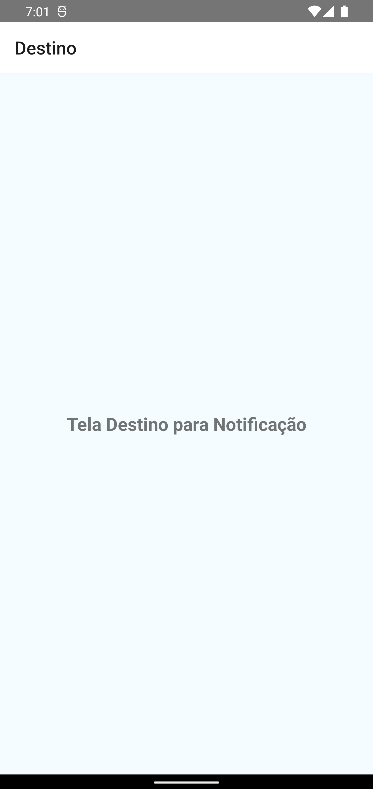

# Notify

This is a project of an app for my android course.

## Table of contents

- [Overview](#overview)
  - [The challenge](#the-challenge)
  - [Built with](#built-with)
- [Author](#author)

## Overview
Notification App
### The challenge

Make local and Schedule Notifications

### Built with

- JS
- REACT-NATIVE

## Author

- Github - [#MyProfile](https://github.com/AlanDavid-007/Notify/)

### Screenshot 
 
 
 
 
 
 

 
